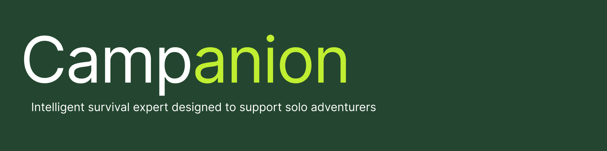

# Campanion - Your AI-Powered Hiking Assistant

Welcome to **Campanion**, the ultimate AI-driven hiking assistant developed for **Calhacks 11.0**. Our mission is to redefine outdoor safety and enjoyment by offering real-time, intelligent support tailored for hikers. Whether you need help navigating trails, sharing your location in emergencies, or getting critical safety information, Campanion is here to guide and protect you throughout your journey.

## Features

- **AI-Powered Chat**: Ask for tips, directions, or safety advice using natural language. Our custom LLM integration ensures you get relevant, context-aware responses.
- **Emergency SOS Mode**: Activate emergency mode to notify contacts, share your location, and interact with an AI for immediate assistance.
- **Real-Time Alerts**: Receive location-based safety alerts and trail conditions to stay informed about your surroundings.
- **Custom Hike Details**: View specific information about the park you're hiking in, including essential safety tips, weather, and emergency contact functionality.
- **Packed Item Context**: Use the packed item list to inform the AI assistant about the gear you’re carrying, enabling more personalized guidance.

## Tech Stack

### Frontend
- **SwiftUI**: The user interface of Campanion is built with SwiftUI for seamless and elegant designs across iOS devices.
- **MapKit**: For location services and providing real-time GPS-based data, we integrate Apple's MapKit.
- **CoreLocation**: Used for geolocation services to track hiker movements and provide relevant park information.

### Backend
- **Google Gemini & ChromaDB**: We utilize **Google Gemini** as our primary LLM in conjunction with **ChromaDB** for vector storage and retrieval in our RAG (Retrieval-Augmented Generation) pipeline.
- **Retrieval-Augmented Generation (RAG)**: To deliver factually accurate and context-rich responses, we implemented RAG, ensuring that users receive answers based on both the LLM’s knowledge and relevant external sources.
- **Azure Services**: We leverage Azure cloud services to deploy and manage our backend API, ensuring scalability and reliability.
- **Custom LLM Backend**: When the Huggingface Gemma model proved unfeasible for iPhone deployment, we built a custom backend to communicate with our RAG-based LLM, providing context-aware responses and safety tips for hikers.

### API
- **Node.js + Express**: Our backend API is built using Node.js with Express, designed to handle requests and communicate with the AI models and databases.
- **PostgreSQL**: A PostgreSQL database is used for storing user data, hike details, and park-specific safety information.
- **LLM Communication**: The API handles requests from the frontend, querying our AI engine with user questions and contextual information such as the park location and packed items.

## Challenges We Overcame
- **Deploying RAG-based LLM**: Initially, we encountered issues with running the Huggingface Gemma model locally on iPhone due to hardware limitations. To solve this, we deployed our own LLM backend, leveraging Google Gemini and ChromaDB to provide accurate and contextually relevant responses.
- **Real-Time Emergency Services**: Implementing a robust emergency notification system that seamlessly integrates with satellite connectivity and contacts required careful architecture and testing.
- **Dynamic Context Handling**: Passing real-time user context (like location and packed items) to the LLM API was essential for providing hikers with accurate guidance.

## How to Use
1. **Download the App**: Install Campanion on your iPhone and set up your emergency contacts.
2. **Start Your Hike**: Select your hiking location and begin your adventure. Campanion will track your progress and offer real-time guidance.
3. **Stay Safe**: Access essential safety information, real-time alerts, and AI-guided tips based on your hike location and packed items.
4. **SOS Mode**: In case of emergencies, activate SOS mode to notify services and contacts, with satellite support to ensure you’re always connected.

## Conclusion

Campanion is more than just a hiking app — it's your AI-powered safety partner on the trail. With a focus on real-time emergency response, personalized guidance, and context-aware interactions, we’ve built a solution that prioritizes hiker safety and enjoyment. Developed for **Calhacks 11.0**, Campanion harnesses the power of cutting-edge AI and real-time technology to redefine outdoor exploration.

  
## License
This project is licensed under the MIT License.

---

